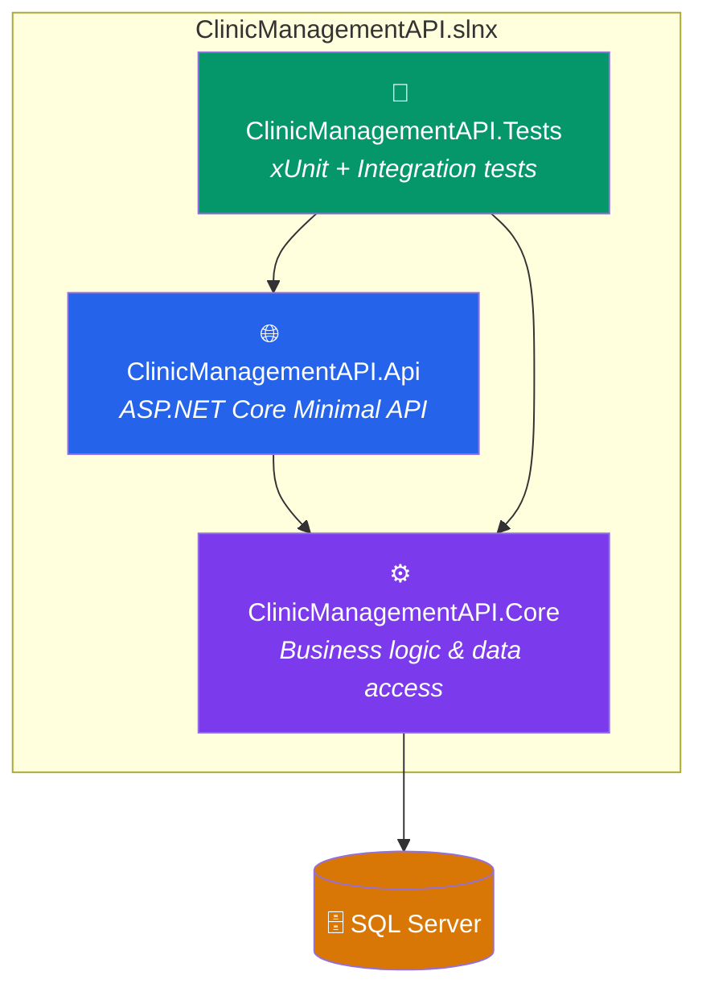
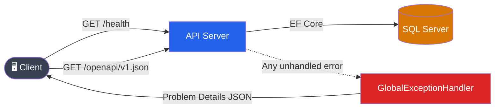

# 🏥 Clinic Management API — Project Overview

## Status: 🟡 In Development (Sprint 5 — Appointments)

---

## What Is This Project?

A RESTful API for managing a medical clinic's daily operations: patient registration, doctor management, and appointment booking. Built as a portfolio project to demonstrate backend engineering skills with real business logic — not just CRUD. Built with **.NET 10** and **ASP.NET Core Minimal API**. The project is planned across **6 sprints** and is currently in Sprint 5.

## Problem Statement

A clinic needs a system where:

- **Receptionists** can register patients, manage appointments, and view schedules
- **Admins** can manage everything including doctors, roles, and deletions
- **Patients** can view available doctors (public access)
- Appointments must respect real-world constraints: no double-booking, no past dates, no overlapping schedules

## Tech Stack — Why Each Choice

| Technology                | Why This Over Alternatives                                                                                                                                    |
|---------------------------|---------------------------------------------------------------------------------------------------------------------------------------------------------------|
| **.NET 10 / C#**          | Enterprise-grade, strong typing, excellent tooling. Dominant in enterprise market and remote positions.                                                       |
| **Minimal API**           | Lighter than Controllers for a focused API. Less ceremony, same capabilities. Better fit for Vertical Slice thinking.                                         |
| **EF Core + SQL Server**  | Industry standard ORM. Code-first migrations, LINQ-to-SQL, Global Query Filters for soft delete.                                                              |
| **ASP.NET Core Identity** | Microsoft-maintained auth system. Handles password hashing, token management, role management — no need to reinvent security.                                 |
| **JWT + Refresh Token**   | Stateless authentication. Access token (60 min) + Refresh token (7 days) for seamless UX without frequent logins.                                             |
| **Result Pattern**        | Expected business errors (wrong password, duplicate email) return `Result.Failure` instead of throwing exceptions. Exceptions reserved for unexpected errors. |
| **xUnit**                 | Most popular .NET testing framework. Clean syntax, parallel execution, strong community.                                                                      |
| **GitHub Actions CI**     | Free for public repos. Runs build + tests on every push. Branch protection ensures main is always green.                                                      |
| **Scalar UI**             | Modern OpenAPI viewer (replaces Swagger UI). Better UX, built-in JWT auth testing.                                                                            |

## Architecture & Design Decisions

### Layered Architecture — 3-Project Solution



**Architecture style:** Layered Architecture with Separation of Concerns. The Api layer depends on Core, but Core knows nothing about the web layer. This follows the core principle of Clean Architecture (dependency flows inward) without the extra abstraction layers that would be over-engineering for a compact project.

### Error Handling Strategy

**Layer 1 — Result Pattern (expected business errors):**
Services return `Result<T>` instead of throwing exceptions. "Wrong password" or "duplicate email" are expected outcomes, not exceptional situations. The endpoint maps `Result.IsSuccess` to 200/201 and `Result.IsFailure` to 400/401/404.

**Layer 2 — Global Exception Handler (unexpected system errors):**
A middleware catches any unhandled exception (database crash, null reference, network timeout), logs the full details for developers, and returns a clean ProblemDetails JSON to the client. Stack traces are never exposed.



### Authentication Design

**Registration:** All new users register as Patient role by default. No self-assigned Admin — only an existing Admin can promote users via `PUT /api/users/{id}/role`.
**Login security:** Returns the same error message ("Invalid credentials") for both wrong password and non-existent email, preventing email enumeration attacks.

### Soft Delete Strategy

**Patient and Doctor use Soft Delete:** Medical data should never be permanently deleted. When a patient or doctor is "deleted", EF Core Global Query Filter automatically hides them from all queries. The data stays in the database for audit trail.
**Appointments do NOT use Soft Delete:** Appointments have a status lifecycle (Scheduled → Completed/Cancelled). Only Cancelled appointments can be hard deleted.

## Entity Relationship Diagram

```text
ApplicationUser (ASP.NET Core Identity)
    │
    │ optional 1:1
    ▼
Patient ←──────────── Appointment ──────────────→ Doctor
  - Id                   - Id                      - Id
  - FullName             - PatientId (FK)           - FullName
  - Email (unique)       - DoctorId (FK)            - Email (unique)
  - Phone                - AppointmentDate          - Phone
  - DateOfBirth          - AppointmentTime          - Specialization
  - Gender               - DurationMinutes          - YearsOfExperience
  - Address              - Status                   - Bio
  - UserId (FK, opt.)    - Notes                    - IsAvailable
  - IsDeleted            - CreatedAt                - IsDeleted
  - DeletedAt            - UpdatedAt                - DeletedAt
  - CreatedAt                                       - CreatedAt
  - UpdatedAt                                       - UpdatedAt
```

## Role Permissions Matrix

| Action                | Admin  | Receptionist | Patient   |
|-----------------------|:------:|:------------:|:---------:|
| Register / Login      | ✅     | ✅           | ✅        |
| View doctors (public) | ✅     | ✅           | ✅        |
| Manage patients (CRUD)| ✅     | ✅           | ❌        |
| Manage appointments   | ✅     | ✅           | ❌        |
| Manage doctors (CRUD) | ✅     | ❌           | ❌        |
| Delete patients (soft)| ✅     | ❌           | ❌        |
| Delete appointments   | ✅     | ❌           | ❌        |
| Assign roles          | ✅     | ❌           | ❌        |

## Business Rules — Appointment Engine

These are the core rules that make this project more than CRUD:

**Booking rules (CreateAsync):**

1. Patient must exist and not be soft-deleted
2. Doctor must exist, not be soft-deleted, and be available (`IsAvailable = true`)
3. Appointment date cannot be in the past
4. Patient cannot have an overlapping Scheduled appointment on the same date
5. Doctor cannot have an overlapping Scheduled appointment on the same date

**Update rules (UpdateAsync):**

- Only Scheduled appointments can be updated
- At least one field must be provided
- New date cannot be in the past
- Current appointment is excluded from conflict check (no self-conflict)

**Status transition rules:**

```text
Scheduled  → Completed  ✅
Scheduled  → Cancelled  ✅
Completed  → anything   ❌ (final state)
Cancelled  → anything   ❌ (final state)
```

## Current Status & Roadmap

| Sprint                   | Focus                        | Key Deliverables                                                                                         | Status     |
|--------------------------|------------------------------|----------------------------------------------------------------------------------------------------------|------------|
| **Sprint 1**             | Project Setup + CI           | Solution structure, CPM, Result Pattern, Error Handling, Health Check, GitHub Actions, Branch Protection | ✅ Done    |
| **Sprint 2**             | Authentication               | Identity, JWT, Refresh Token, Roles seeding, Input Validation, Logout                                    | ✅ Done    |
| **Sprint 3**             | Patients CRUD                | ISoftDeletable, Patient model, Soft Delete, Global Query Filter, Search, Pagination, Assign Role         | ✅ Done    |
| **Sprint 4**             | Doctors CRUD                 | Doctor model, Soft Delete, Public GET endpoints, Available doctors filter, Admin-only write, 118 tests   | ✅ Done    |
| **Sprint 5**             | Appointments                 | Business rules, Overlap detection, Status transitions, Date/Status filters                               | 🟡 Active  |
| **Sprint 6**             | Polish                       | Error consistency, Scalar UI, README, Code cleanup, Git strategy, Coverage review                        | ⬜ Pending |

## What This Project Demonstrates

**Engineering decisions that go beyond junior level:**

- Clean project structure with clear separation of concerns (Minimal APIs + Core services)
- `Directory.Build.props` for shared build settings and `Directory.Packages.props` for Central Package Management
- Result Pattern separating business errors from system errors
- Soft Delete with EF Core Global Query Filters (`IsDeleted = 0`)
- `IgnoreQueryFilters()` for email uniqueness across soft-deleted records
- `DeleteBehavior.Restrict` on FK relationships to protect data integrity
- Default Patient role on registration to prevent privilege escalation
- Highly tested code with 118 passing unit/integration tests and 100% service coverage
- Proper integration testing with WebApplicationFactory spinning up in-memory instances
- Health Check endpoint for production monitoring readiness
