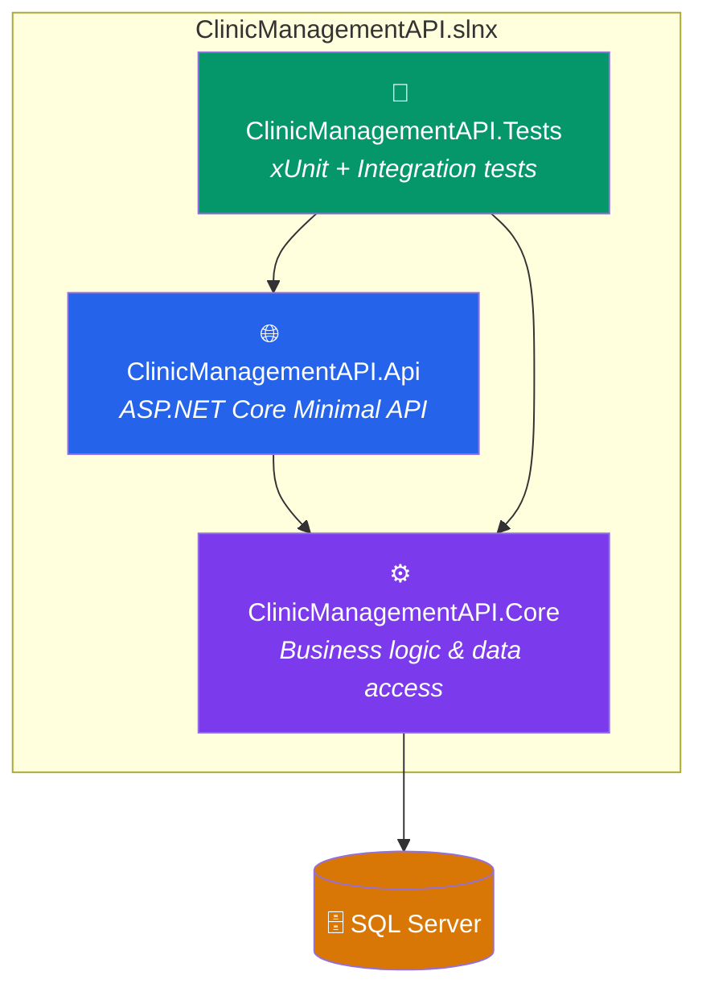
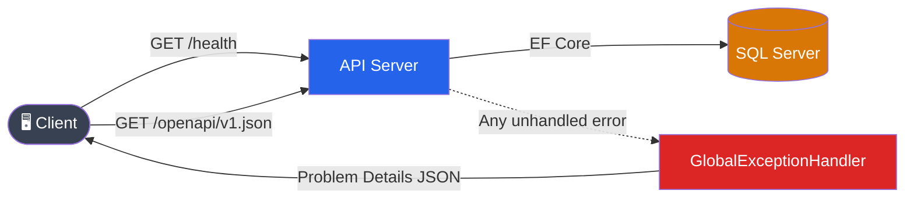

# 🏥 Clinic Management API — Project Overview

## Status: 🟡 Early Development (Sprint 1 — wrapping up)

---

## What Is This?

A RESTful API for managing clinic appointments, patients, and doctors, built with **.NET 10** and **ASP.NET Core Minimal API**. The project is planned across **6 sprints** and is currently finishing Sprint 1 (foundation & infrastructure).

---

## Architecture

| Project | Role | Key Contents |
|---------|------|-------------|
| **ClinicManagementAPI.Api** | HTTP layer | Endpoints, Middleware, DTOs, [Program.cs](file:///d:/CSharp-Knowledge-Base/Projects/clinic-management-api/ClinicManagementAPI.Api/Program.cs) |
| **ClinicManagementAPI.Core** | Business layer | Models, Services, Interfaces, DbContext |
| **ClinicManagementAPI.Tests** | Testing | Unit/ and Integration/ test folders |

---

## File Inventory (25 source files)

### Api Project
| File | Purpose |
|------|---------|
| [Program.cs](file:///d:/CSharp-Knowledge-Base/Projects/clinic-management-api/ClinicManagementAPI.Api/Program.cs) | App entry point — registers services, middleware, endpoints |
| [GlobalExceptionHandler.cs](file:///d:/CSharp-Knowledge-Base/Projects/clinic-management-api/ClinicManagementAPI.Api/Middleware/GlobalExceptionHandler.cs) | Catches all unhandled exceptions → returns Problem Details JSON |
| [appsettings.json](file:///d:/CSharp-Knowledge-Base/Projects/clinic-management-api/ClinicManagementAPI.Api/appsettings.json) | Config with `ClinicDb` connection string placeholder |
| [launchSettings.json](file:///d:/CSharp-Knowledge-Base/Projects/clinic-management-api/ClinicManagementAPI.Api/Properties/launchSettings.json) | Dev server URL/port configuration |
| `DTOs/` | Empty — ready for request/response DTOs |
| `Endpoints/` | Empty — ready for Minimal API endpoint groups |

### Core Project
| File | Purpose |
|------|---------|
| [AppDbContext.cs](file:///d:/CSharp-Knowledge-Base/Projects/clinic-management-api/ClinicManagementAPI.Core/Data/AppDbContext.cs) | EF Core DbContext — empty, no `DbSet<>` entities yet |
| [Result.cs](file:///d:/CSharp-Knowledge-Base/Projects/clinic-management-api/ClinicManagementAPI.Core/Models/Result.cs) | Result pattern model |
| [Class1.cs](file:///d:/CSharp-Knowledge-Base/Projects/clinic-management-api/ClinicManagementAPI.Core/Class1.cs) | ⚠️ Template placeholder — can be deleted |
| `Models/` | Ready for domain entities (Patient, Doctor, Appointment, etc.) |
| `Services/` | Empty — ready for business logic |
| `Interfaces/` | Empty — ready for service contracts |

### Tests Project
| File | Purpose |
|------|---------|
| [UnitTest1.cs](file:///d:/CSharp-Knowledge-Base/Projects/clinic-management-api/ClinicManagementAPI.Tests/UnitTest1.cs) | ⚠️ Template placeholder — can be deleted |
| `Unit/` | Ready for unit tests |
| `Integration/` | Ready for integration tests (has `WebApplicationFactory` package) |

### Solution-Level Config
| File | Purpose |
|------|---------|
| [Directory.Build.props](file:///d:/CSharp-Knowledge-Base/Projects/clinic-management-api/Directory.Build.props) | `net10.0`, nullable enabled, warnings-as-errors |
| [Directory.Packages.props](file:///d:/CSharp-Knowledge-Base/Projects/clinic-management-api/Directory.Packages.props) | Central Package Management — all NuGet versions in one place |
| [.editorconfig](file:///d:/CSharp-Knowledge-Base/Projects/clinic-management-api/.editorconfig) | Code style rules, naming conventions, formatting |
| [.gitignore](file:///d:/CSharp-Knowledge-Base/Projects/clinic-management-api/.gitignore) | Comprehensive ignore rules for .NET + IDE + OS files |
| [.gitattributes](file:///d:/CSharp-Knowledge-Base/Projects/clinic-management-api/.gitattributes) | Line ending normalization, C#-aware diffs |

### CI/CD & GitHub
| File | Purpose |
|------|---------|
| [build.yml](file:///d:/CSharp-Knowledge-Base/Projects/clinic-management-api/.github/workflows/build.yml) | GitHub Actions — restore → build → test on push/PR |
| [dependabot.yml](file:///d:/CSharp-Knowledge-Base/Projects/clinic-management-api/.github/dependabot.yml) | Auto-updates NuGet packages & Actions weekly |

### Documentation
| File | Purpose |
|------|---------|
| [README.md](file:///d:/CSharp-Knowledge-Base/Projects/clinic-management-api/README.md) | Project intro, setup instructions, endpoint docs |
| [PROJECT-OVERVIEW.md](file:///d:/CSharp-Knowledge-Base/Projects/clinic-management-api/docs/PROJECT-OVERVIEW.md) | Detailed project design document |
| [DEVELOPMENT-STANDARDS.md](file:///d:/CSharp-Knowledge-Base/Projects/clinic-management-api/docs/DEVELOPMENT-STANDARDS.md) | Coding standards & conventions |
| Sprint 1–6 Checklists | Roadmap in `Roadmap/` folder |

---

## What's Working Right Now

| Feature | Status |
|---------|--------|
| Project structure (Api / Core / Tests) | ✅ Done |
| EF Core + SQL Server connection | ✅ Done |
| Global exception handling (Problem Details) | ✅ Done |
| Health check endpoint (`/health`) | ✅ Done |
| OpenAPI / Scalar docs | ✅ Done (dev only) |
| CI pipeline (GitHub Actions) | ✅ Done |
| Dependabot | ✅ Done |
| Central Package Management | ✅ Done |
| Code style enforcement (.editorconfig) | ✅ Done |
| User Secrets for connection string | ✅ Done |
| Domain models (Patient, Doctor, etc.) | ❌ Not yet |
| API endpoints (CRUD) | ❌ Not yet |
| JWT authentication | ❌ Not yet |
| Unit & integration tests | ❌ Not yet |
| EF Core migrations | ❌ Not yet |

---

## Sprint Roadmap

| Sprint | Focus | Status |
|--------|-------|--------|
| **Sprint 1** | Foundation — project setup, CI, error handling, health checks | 🟡 Finishing |
| **Sprint 2** | Domain models & database | ⬜ Not started |
| **Sprint 3** | Core API endpoints (CRUD) | ⬜ Not started |
| **Sprint 4** | Authentication & authorization (JWT) | ⬜ Not started |
| **Sprint 5** | Advanced features | ⬜ Not started |
| **Sprint 6** | Polish & deployment | ⬜ Not started |

---

## NuGet Packages (all centrally managed)

| Package | Version | Used In |
|---------|---------|---------|
| Microsoft.EntityFrameworkCore | 10.0.3 | Core |
| Microsoft.EntityFrameworkCore.SqlServer | 10.0.3 | Api |
| Microsoft.EntityFrameworkCore.Design | 10.0.3 | Api |
| Microsoft.EntityFrameworkCore.InMemory | 10.0.3 | Tests |
| Microsoft.AspNetCore.Authentication.JwtBearer | 10.0.3 | Api |
| Microsoft.AspNetCore.Identity.EntityFrameworkCore | 10.0.3 | *(ready)* |
| Microsoft.AspNetCore.OpenApi | 10.0.3 | Api |
| Scalar.AspNetCore | 2.12.46 | Api |
| Microsoft.Extensions.Diagnostics.HealthChecks.EFCore | 10.0.3 | Api |
| xUnit | 2.9.3 | Tests |
| Microsoft.NET.Test.Sdk | 17.14.1 | Tests |
| Microsoft.AspNetCore.Mvc.Testing | 10.0.3 | Tests |
| coverlet.collector | 6.0.4 | Tests |

---

## Cleanup Notes

> [!TIP]
> Two template placeholder files can be safely deleted when you're ready:
> - [ClinicManagementAPI.Core/Class1.cs](file:///d:/CSharp-Knowledge-Base/Projects/clinic-management-api/ClinicManagementAPI.Core/Class1.cs)
> - [ClinicManagementAPI.Tests/UnitTest1.cs](file:///d:/CSharp-Knowledge-Base/Projects/clinic-management-api/ClinicManagementAPI.Tests/UnitTest1.cs)

---

## Summary

The foundation is **solid and well-structured**. You've set up all the infrastructure scaffolding before writing business logic, which is the right approach. The next step (Sprint 2) would be defining your domain models and creating the first EF Core migration.
